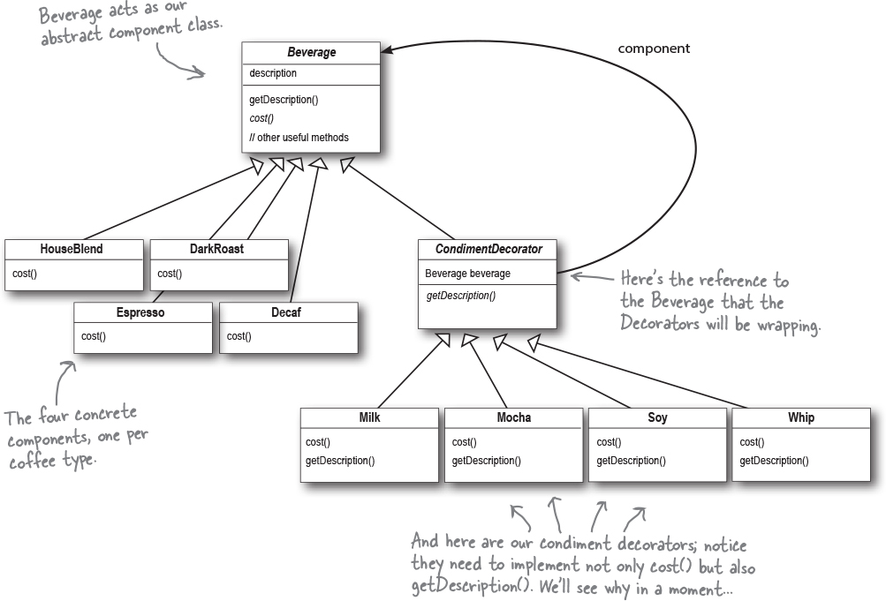

# Decorator Pattern

The Decorator Pattern attaches additional responsibilities to an object dynamically. Decorators provide a flexible alternative to subclassing for extending functionality.

## Classes

### Beverage (abstract class)
- CondimentDecorator extends Beverage
  - This makes a condiment a beverage
- DarkRoast extends Beverage
- HouseBlend extends Beverage

### CondimentDecorator (abstract class)
- Mocha extends CondimentDecorator
- Soy extends CondimentDecorator
- Whip extends CondimentDecorator

## Diagram
