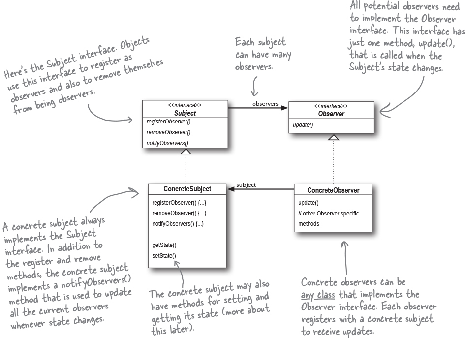

# Observer Pattern

The Observer Pattern defines a one-to-many dependency between objects so that when one object changes state, all of its dependents are notified and updated automatically.

## Observer
- The dependent object who get notified
- You can push or pull data from the Subject when using the pattern (pull is considered more "correct").

## Subject
- A Subject holds state
- A Subject updates Observers using a common interface

## Classes

### Subject (interface)
- WeatherData implements Subject

### Observer (interface)
- CurrentConditionsDisplay implements Observer

## Diagram
