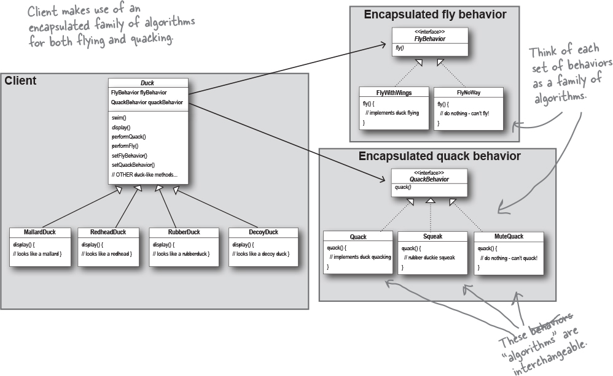

# Strategy Pattern

The Strategy Pattern defines a family of algorithms, encapsulates each one, and makes them interchangeable. Strategy lets the algorithm vary independently from clients that use it.

## Duck (abstract class)
- MallardDuck extends Duck
- ModuleDuck extends Duck

## Fly Behavior (interface)
- FlyNoWay implements FlyBehavior
- FlyRocketPowered implements FlyBehavior
- FlyWithWings implements FlyBehavior

## Quack Behaviour (interface)
- MuteQuack implements QuackBehavior
- Quack implements QuackBehavior
- Squeak implements QuackBehavior

## Diagram
